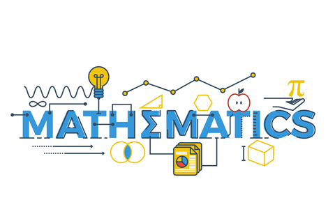

# <b>Welcome to M-Power Math Compendium</b>

  

>
> WARNING: This site is in draft mode; pages that are stubbed with "no contents" will yield a `404-Not Found error`. This is by design.
>
> The contents of this portal is rapidily evolving and reflects most of the concepts found in the **"Art of Problem Solving"** textbook, and many of my favoriate math topics. If you see gaps or errors with sitedocs, please contact: Jeffrey Lucas, Math/CS Mentor - &lt;email:lucasjt@gmail.com&gt; for updates and erratas.

---

Welcome to our **Math Learning Portal**, the go-to destination for mastering mathematics at all levels! Whether you're just starting with the basics or diving deep into advanced topics, the portal offers a structured and engaging learning experience in both mathematics. Our goal is to deepen your understanding of these subjects.

The content is designed with a strong theoretical emphasis to help you become familiar with mathematical and logical notations, and to develop a deeper sense of abstraction in the art of problem-solving. The aim is to immerse you in the language of mathematics, teaching you how to interpret and contextualize the types of math and computer science questions you will undoubtedly encounter. Additionally, you'll be rigorously tested, sharpening your critical thinking skills to their fullest potential. Happy learning and become brighter each, and every day.

Here, you'll explore everything from **Elementary Mathematics** to **Advanced Concepts** in a way that fosters curiosity and understanding. Our notes and lessons cover key areas, including:

- **Elementary Math**: Master basic concepts with an emphasis on number theory exposure.
- **Algebra I & II**: Master linear equations, inequalities, polynomials, quadratic functions, and more.
- **Modular Arithmetic**: Become procient in circle math by introspect the underpinnings of **remainders** and **quotients**.
- **Geometry**: Delve into the properties of shapes, theorems, and spatial reasoning.
- **Number Theory**: Explore the fascinating world of integers, prime numbers, and divisibility.
- **Modern Algebra**: Study more advanced topics like groups, rings, and fields to build a foundation in abstract algebra.

Each topic is broken down into digestible lessons, with practice problems, interactive tools, and real-world applications to reinforce learning. Whether you're a beginner or an advanced learner, our portal is designed to support your mathematical journey and help you excel!