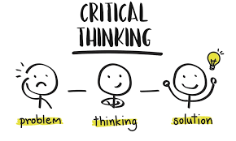

# **Critical Thinking** - This is the Way!

  

**[Critical thinking](https://iep.utm.edu/critical-thinking/)** is the ability to analyze, evaluate, and synthesize information to make reasoned judgments. It's essential for problem-solving, decision-making, and developing a deeper understanding of the world. Teaching this skill to elementary students lays the foundation for lifelong learning and informed citizenship.

### Key Aspects of Critical Thinking
1. **Analysis**: Breaking down information into parts to understand it better.
2. **Evaluation**: Judging the validity or importance of information.
3. **Inference**: Making connections between ideas or drawing conclusions from data.
4. **Explanation**: Communicating the reasoning behind ideas.
5. **Reflection**: Assessing one’s own thoughts and assumptions.

### Methods to Teach Critical Thinking to Students

1. **Ask Open-Ended Questions**
   Encourage students to think beyond yes/no answers by asking questions that require them to explain their reasoning. Examples include:
   > - "Why do you think that happened?"
   > - "What would happen if…?"
   > - "How could you solve this differently?"

2. **Promote Problem-Based Learning**
   Present real-world problems for students to solve. For example:
   > - Pose a situation where a village needs to find a solution for clean water.
   > - Ask students how they would organize a school event and what steps they'd take.

3. **Encourage Curiosity**
   Create opportunities for students to explore questions they are naturally curious about. Encourage them to ask "why" and "how" questions about the world around them. You can use the following methods:
   > - **Wonder Walls**: Create a space where students can post questions they’re curious about, and work together to find answers.
   > - **Research Projects**: Let students investigate topics of interest and present their findings.

4. **Teach Through Games and Puzzles**
   Use logic games, puzzles, and problem-solving activities to engage students in critical thinking. Examples:
   > - **Chess** or **strategy-based games** like checkers, which teach planning and foresight.
   > - **Word puzzles** or **number puzzles** like Sudoku, which develop pattern recognition and logical reasoning.

5. **Model Thinking Aloud**
   Show students how you think through problems by verbalizing your thought process. For example, when solving a math problem, you might say:
   > - “First, I need to figure out what information I have. Then, I’ll think about what I’m being asked to find.”
   > - “Let me check if my steps make sense so far.”

6. **Encourage Group Discussions and Debates**
   Set up group activities where students can discuss topics and share different viewpoints. Guide them to listen to others, challenge ideas respectfully, and support their arguments with evidence.

7. **Use Stories and Scenarios**
   Present scenarios through storytelling where students must think critically about the characters’ decisions. Example questions include:
   > - “Was the character’s decision the best one? Why or why not?”
   > - “What could they have done differently?”

8. **Connect Critical Thinking to Daily Life**
   Help students apply critical thinking in practical situations, like:
   > - Analyzing advertisements: “What are they trying to convince you of?”
   > - Investigating environmental issues: “How can we reduce waste in our school?”

9. **Reflective Journals**
   Ask students to write about their learning experiences or how they approached solving a problem. This fosters self-reflection and the ability to assess their thinking process.

10. **Encourage Metacognition**
   Teach students to think about their thinking. Questions like “What strategy worked best for you?” or “What would you do differently next time?” help them evaluate and improve their approach to problems.

### Example Activities to Develop Critical Thinking

- **Mystery Box**: Place an object inside a box, and students must ask yes/no questions to figure out what’s inside.
- **What If Scenarios**: Present a situation like, “What if everyone in the world could only eat one type of food?” and have students explore the consequences.
- **Decision Trees**: Use a diagram to map out the different choices in a story or problem and their possible outcomes.

By integrating these methods into daily lessons, students will develop critical thinking skills in a fun and engaging way, empowering them to be thoughtful and creative problem-solvers.

---

**References**:

* **Books:**
      - Boaler, J. (2016). *Mathematical Mindsets: Unleashing Students’ Potential through Creative Math, Inspiring Messages, and Innovative Teaching*. Jossey-Bass.
      - Boaler, J. (2015). *What's Math Got to Do with It? How Parents and Teachers Can Help Children Learn to Love Their Least Favorite Subject*. Penguin.
      - Paul, R., & Elder, L. (2014). *Critical Thinking: Tools for Taking Charge of Your Professional and Personal Life*. Pearson.
      - Facione, P. A. (2011). *Critical Thinking: A Statement of Expert Consensus for Purposes of Educational Assessment and Instruction*. The Delphi Report.
      - Dweck, C. S. (2016). *Mindset: The New Psychology of Success*. Ballantine Books.

* **Online:**
      - CK-12 Foundation. (n.d.). *Critical Thinking Frameworks*. CK-12 Foundation. Retrieved from [https://www.ck12.org](https://www.ck12.org)
      - CK-12 Foundation. (n.d.). *Growth Mindset: A Guide to Personal Development*. CK-12 Foundation. Retrieved from [https://www.ck12.org](https://www.ck12.org)
      - Wikipedia contributors. (2023, September 25). *Critical thinking*. In Wikipedia, The Free Encyclopedia. Retrieved from [https://en.wikipedia.org/wiki/Critical_thinking](https://en.wikipedia.org/wiki/Critical_thinking)
      - Wikipedia contributors. (2023, April 20). *Mindset*. In Wikipedia, The Free Encyclopedia. Retrieved from [https://en.wikipedia.org/wiki/Mindset](https://en.wikipedia.org/wiki/Mindset)