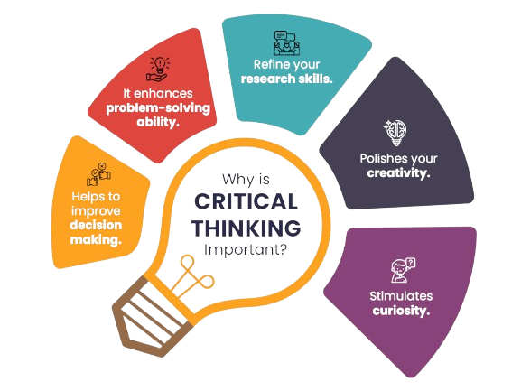

# Critical Thinking Framework

Building upon our earlier discussion on [critical thinking](https://iep.utm.edu/critical-thinking/) and methods to cultivate it among elementary students, several theoretical frameworks offer deeper insights into this essential skill. Notable among these are the **[Paul-Elder Critical Thinking Framework](https://louisville.edu/ideastoaction/about/criticalthinking/framework/)** and **[Bloom's Taxonomy](https://cft.vanderbilt.edu/guides-sub-pages/blooms-taxonomy/)**.

  

## Paul-Elder Critical Thinking Framework

This framework posits that critical thinking involves understanding the elements of thought and applying intellectual standards to them. The key components include:

- **Elements of Thought**: Purpose, question at issue, information, interpretation, concepts, assumptions, implications, and point of view.

- **Intellectual Standards**: Clarity, accuracy, precision, relevance, depth, breadth, logic, significance, and fairness.

By consistently applying these standards to the elements of thought, individuals can develop intellectual traits such as humility, courage, empathy, autonomy, integrity, perseverance, confidence in reason, and fair-mindedness [(citation: ScienceDirect)](https://www.sciencedirect.com/science/article/abs/pii/S1871187114000030)

## Bloom's Taxonomy

Bloom's Taxonomy categorizes cognitive skills into six hierarchical levels:

1. **Knowledge**: Recall of information.
2. **Comprehension**: Understanding of information.
3. **Application**: Using knowledge in new situations.
4. **Analysis**: Breaking down information into components.
5. **Synthesis**: Combining elements to form a new whole.
6. **Evaluation**: Making judgments based on criteria.

We can utilize this taxonomy to design activities that promote higher-order thinking skills, encouraging students to move beyond mere memorization to analysis, synthesis, and evaluation [citation:Paul-Elder](https://louisville.edu/ideastoaction/about/criticalthinking/framework/).

## Integrating Theoretical Frameworks into Practice

To effectively foster critical thinking in elementary, middle-schoolers and high school students, we as educators & mentors can:

- **Combine Frameworks**: Use Bloom's Taxonomy to structure learning objectives that align with the intellectual standards of the Paul-Elder framework.

- **Design Structured Activities**: Create tasks that require students to analyze, evaluate, and synthesize information, guiding them through the cognitive processes outlined in these frameworks.

- **Encourage Self-Reflection**: Incorporate metacognitive activities that prompt students to reflect on their thinking processes, helping them internalize critical thinking skills.

By embedding these theoretical frameworks into educational practices, we can enhance our strategies for developing critical thinkers from a very young age.

---

**Citation**:

* **Books:**
    - Paul, R., & Elder, L. (2014). *Critical Thinking: Tools for Taking Charge of Your Professional and Personal Life*. Pearson.
    - Paul, R., & Elder, L. (2007). *The Miniature Guide to Critical Thinking Concepts and Tools*. Foundation for Critical Thinking.

* **Online:**
    - CK-12 Foundation. (n.d.). *Mental Models in Thinking*. CK-12 Foundation. Retrieved from [https://www.ck12.org](https://www.ck12.org)
    - Wikipedia contributors. (2023, September 25). *Mental model*. In Wikipedia, The Free Encyclopedia. Retrieved from [https://en.wikipedia.org/wiki/Mental_model](https://en.wikipedia.org/wiki/Mental_model)
    - Wikipedia contributors. (2023, August 20). *Bloom's taxonomy*. In Wikipedia, The Free Encyclopedia. Retrieved from [https://en.wikipedia.org/wiki/Bloom%27s_taxonomy](https://en.wikipedia.org/wiki/Bloom%27s_taxonomy)