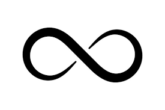

# Mental Excercise: Infinity

What do you think of infinity?

  

---

Click [here](infinity_retro.md) for introspection.

---
Some further questions:

- What about bounded infinity
- Immeasurable, is it one and the same?
- Is it a dimension? Does it have direction?
- infinitesimally big or infinitesimally small
- Forever
- {...}
- Blackholes, are they related to infinity?

